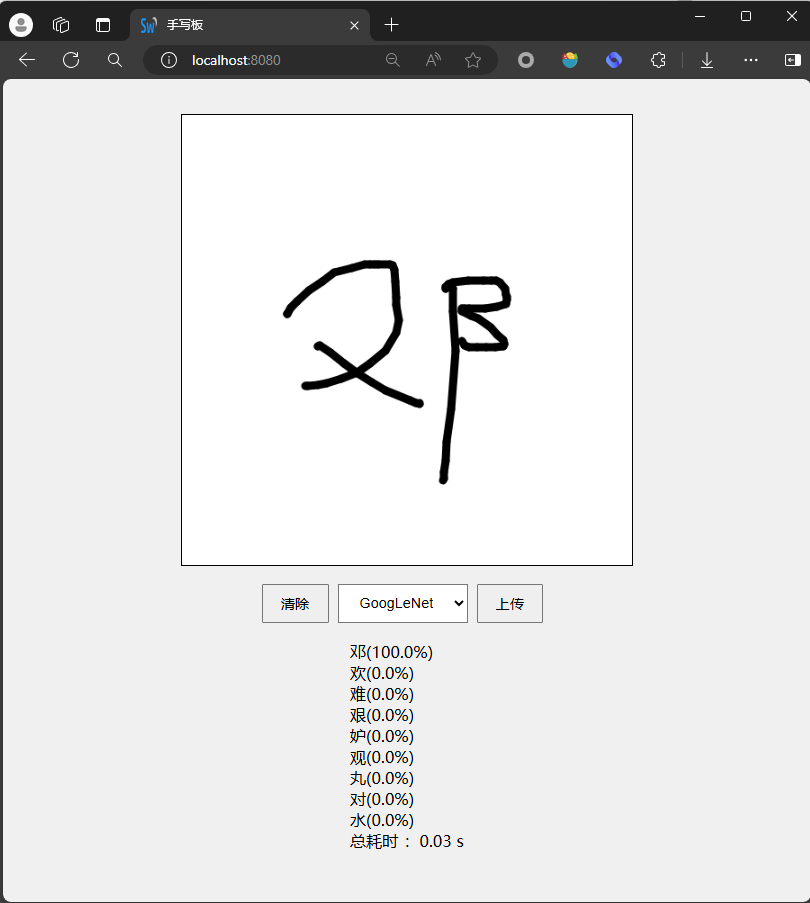

# Handwritten Character Recognition Project
A simple single handwritten Chinese character recognition project implemented using PyTorch.

## Installation
``` cmd
pip install -r requirements.txt
```

## Download Dataset
``` cmd
python utils/pot_downloader.py
```

## Data Preprocessing (Convert to JPG)
``` cmd
python dataset/handwritten_pot_dataset.py
```

## Train the Model
``` cmd
export DATA_SET_FOLDER=work
export MODEL_FOLDER=pretrain
export TRAIN_FOLDER=PotTrain
export TEST_FOLDER=PotTest
export NUM_EPOCHS=11
export BATCH_SIZE=512
python handwritten_training_googlenet.py
```

## Starting project
``` cmd
python web/server.py
```





## Some Notes
This is my first neural network training project. The entire model is trained based on GoogLeNet and can recognize over 3000 primary Chinese characters, single English letters, and punctuation marks (mainly because the dataset from the Chinese Academy of Sciences contains this amount). The accuracy on the validation set reaches 94%. The source code also includes other algorithms, but I haven't bothered to simplify the code, so it stays as it is.